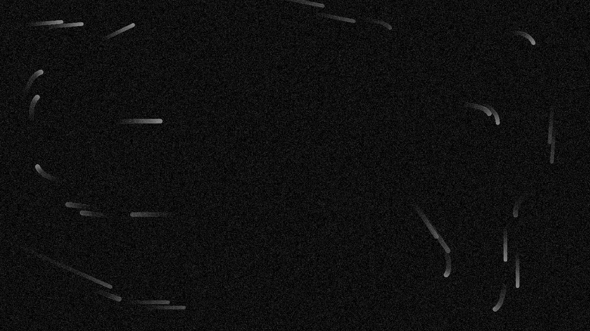
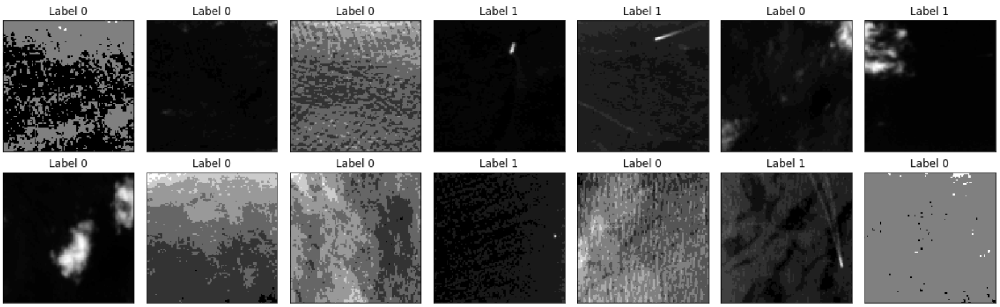
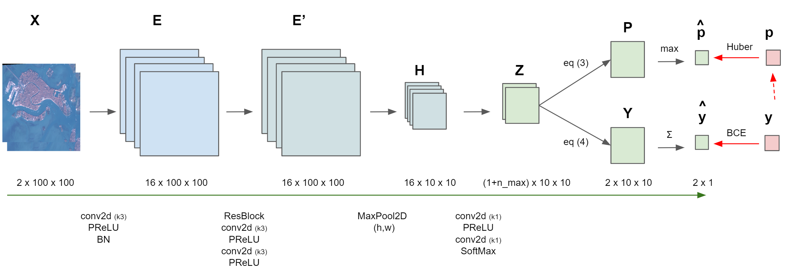
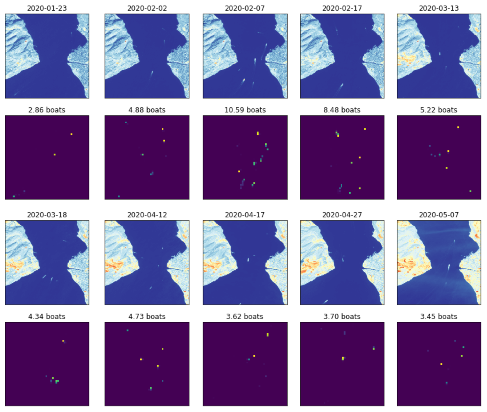
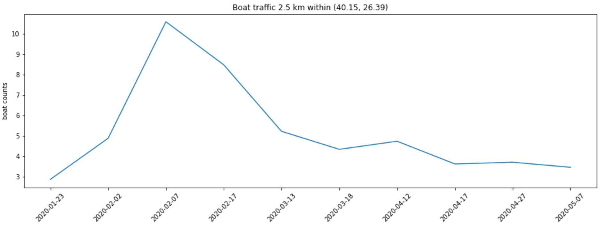

# ☄️ sentinel2-xcube-boat-detection

Github repository to detect and counts boat traffic 🚢🛳️🛥️ in [Sentinel-2 imagery](https://sentinel.esa.int/web/sentinel/missions/sentinel-2) using temporal, spectral and spatial features.

## ⛵ Setup

##### With EDC
- Clone this repository in a Jupyter Lab environment (Python 3.6+) on Euro Data Cube Dashboard (requires a valid account)
- Edit Sentinel Hub credentials and [Mapbox](https://studio.mapbox.com/) token in a .env file (requires a valid account).
- Clone this repository and run ```pip install -r requirements.txt```
- TODO: Edit Docker image.



## 🛰️ Pipeline

### 1. 📷 Annotate 1 squared km chips with boat counts.

Download [Sentinel 2](https://sentinel.esa.int/web/sentinel/missions/sentinel-2) L1C products (bands B03, B08, [CLP](https://github.com/sentinel-hub/sentinel2-cloud-detector)) from [Sentinel Hub](https://www.sentinel-hub.com/) via [xcube-sh](https://github.com/dcs4cop/xcube-sh). Remove nans and cloudy images with CLP. Compute NDWI. Background NDWI estimation by multi frame fusion (max over time). BG NDWI can be used to obtain a water/land mask M after thresholding. 

Annotate chips with [superintendent](https://github.com/janfreyberg/superintendent) and [scikit-image](https://scikit-image.org/)



### 2. 🔭 Learn to detect and count boat traffic

- Input (2 channels): NIR Band (foreground+background) and Background NDWI (background)
- Pytorch model: Residual Network (pixel embedding) + MaxPool2D (patch encoding) + 2-layer 1x1 conv2D (patch latent code Z) + Clf/Reg prediction.



### 3. 🗺️ Deploy

Deploy model on large AOI (Ports, Straits, MPA). Example below for the Dardanelles Strait (25 squared km).





## TODO List:

###### See Annexe.

## Press

###### 📡 2020/05/06 CNES SpaceGate [Article](https://spacegate.cnes.fr/fr/covid-19-venise-sans-les-bateaux)
###### 🛰️ 2020/04/15 ESA [Tweet](https://mobile.twitter.com/EO_OPEN_SCIENCE/status/1250367319936765953)
###### 🛰️ 2020/04/06 ESA [Covid-19 Custom Script Contest](https://www.sentinel-hub.com/contest)

## Credits

[ESA](https://www.esa.int/), [Copernicus](https://scihub.copernicus.eu/dhus/#/home), [Euro Data Cube](https://eurodatacube.com/), [Sinergise](https://www.sinergise.com/)

## License (TBD)
