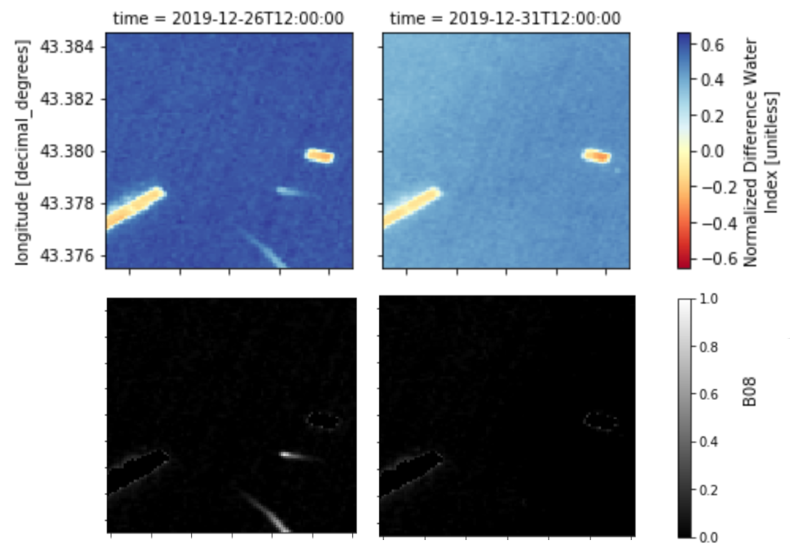
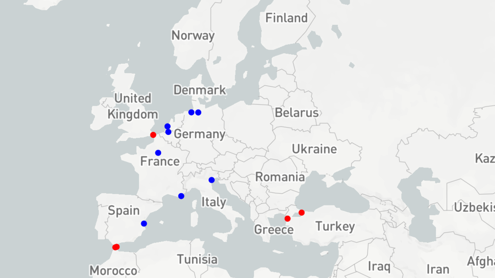

# 🛰️🌍 sentinel2-xcube-boat-detection

## 🚢🛳️⛵🛥️ Counting Boat Traffic // Counting Comets ☄️ (temporal, spectral, spatial dimensions) 


## How it works

### 📷 Background NDWI estimation for Water/Land Segmentation: BG NDWI

Github repository to detect and counts boat counts in [Sentinel-2 imagery](https://sentinel.esa.int/web/sentinel/missions/sentinel-2) using temporal, spectral and spatial features.

### 🔭 Foreground Boat detection by learning to see and count traffic

## Setup
- Clone this repository with ```git clone ...``` in a Jupyter Lab environment on Euro Data Cube Dashboard (requires a valid account)
- Edit Sentinel Hub credentials and [Mapbox](https://studio.mapbox.com/) token in a .env file (requires a valid account).
- TODO: Edit requirements.txt and Docker image.

## Pipeline

### 1. Annotate 1 squared km chips with boat counts.

Download [Sentinel 2](https://sentinel.esa.int/web/sentinel/missions/sentinel-2) L1C products (bands B03, B08, [CLP](https://github.com/sentinel-hub/sentinel2-cloud-detector)) from [Sentinel Hub](https://www.sentinel-hub.com/) via [xcube-sh](https://github.com/dcs4cop/xcube-sh). Remove nans and cloudy images with CLP. Compute NDWI. Background estimation by multi frame fusion: Max NDWI (over time) approximates BG NDWI. BG NDWI can be used to obtain a water land mask M.




### 2. Learn to detect and count boat traffic

- Input: Img NIR Band + Background NDWI (2 channels)
- Architecture: Residual Network (pixel embedding) + MaxPool2D (patch encoding) + 2-layer 1x1 conv2D (patch latent code Z) + Clf/Reg prediction.


### 3. Deploy

Deploy model on large AOI (Ports, Straits, MPA).




## Extensions:

### False Positives: Waves, Tides, etc. 🌊

### Extend to Sentinel-1 🛰️
https://sentinelhub-py.readthedocs.io/en/latest/examples/ogc_request.html?highlight=sentinel-1

## Press

- 📡 CNES SpaceGate [Article](https://spacegate.cnes.fr/fr/covid-19-venise-sans-les-bateaux)
- 🛰️ 2020/04/15 ESA [Tweet](https://mobile.twitter.com/EO_OPEN_SCIENCE/status/1250367319936765953)
- 🛰️ 2020/04/06 ESA [Covid-19 Custom Script Contest](https://www.sentinel-hub.com/contest)

## Credits

[ESA](https://www.esa.int/), [Copernicus](https://scihub.copernicus.eu/dhus/#/home), [Euro Data Cube](https://eurodatacube.com/), [Sinergise](https://www.sinergise.com/)

## License (TBD)
